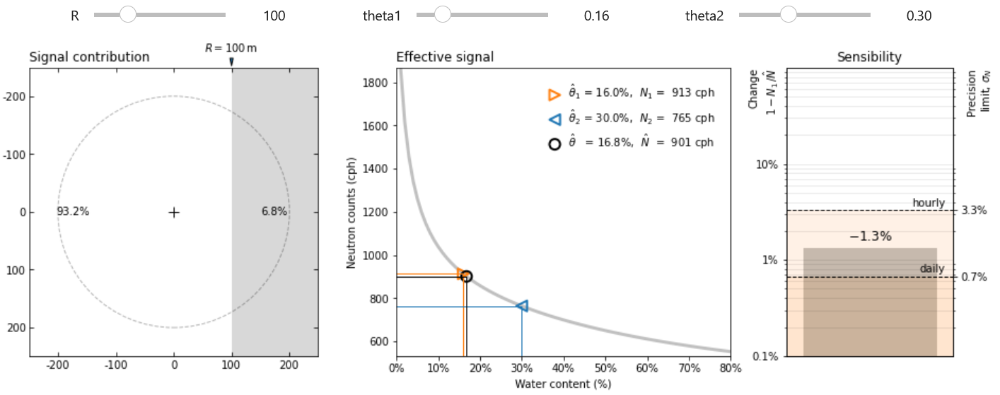
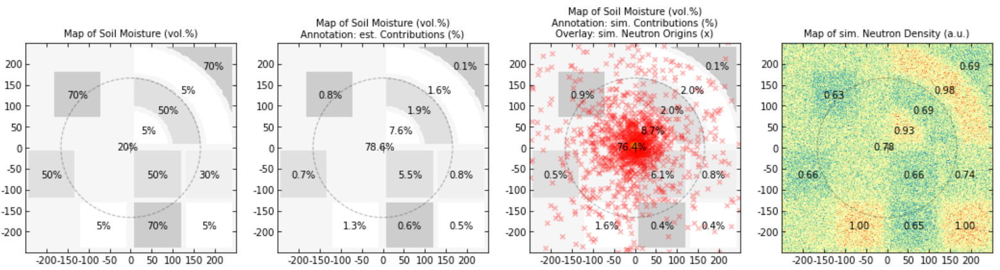

# CRNS Footprint GUI

Signal Contribution and practical footprint estimations for cosmic-ray neutron sensors (CRNS)

[](https://zenodo.org/badge/latestdoi/448658297)
[](https://doi.org/10.5194/hess-27-723-2023)


### Run online

[](https://crns-footprint-gui.streamlit.app)  
Try it out interactively with Streamlit!

### Run locally

Execute in the command line: 
```
streamlit run footprint_gui.py
```

## Features

Interactively estimate the contribution of remote fields:  


Interactively calculate the practical footprint distance:  


Display user-defined scenarios and URANOS simulations:  


## Install locally

The scripts can be used locally with own data.

1. Download the repository,
2. Install Python 3
3. Install the required packages with `pip install -r requirements.txt`,
4. Copy your scenario files to the examples/ folder.
5. Run and have fun :-)

## Cite as:

> Schrön, M., Köhli, M., and Zacharias, S.: Signal contribution of distant areas to cosmic-ray neutron sensors – implications for footprint and sensitivity, Hydrol. Earth Syst. Sci., 27, 723–738, [doi:10.5194/hess-27-723-2023](https://doi.org/10.5194/hess-27-723-2023), 2023.
